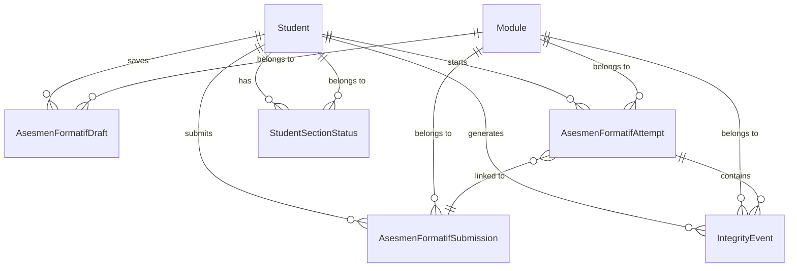
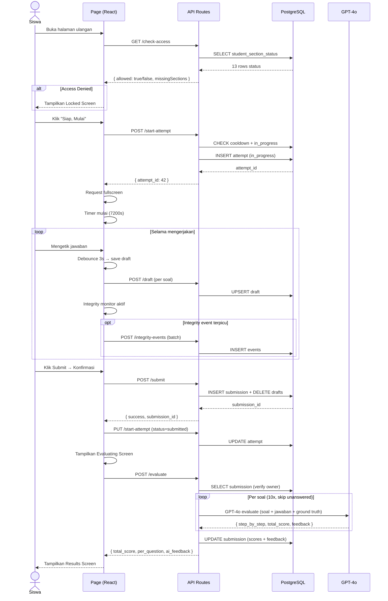

# Asesmen Formatif — Database & API Architecture (Generic Template)

> **Related**: [00-overview.md](./00-overview.md) — baca dulu untuk gambaran umum.
>
> 📋 **Konvensi Template**: Placeholder `{{...}}` diganti per modul. Lihat [§7 — Contoh Instansiasi](#7-contoh-instansiasi-kaidah-pencacahan).

---

## 1. Entity Relationship Diagram (Database)



---

## 2. Database Schema

### 2.1 `modules`

```sql
-- Menyimpan data modul pembelajaran
CREATE TABLE modules (
    module_id SERIAL PRIMARY KEY,
    slug      VARCHAR UNIQUE NOT NULL,  -- e.g. "kaidah-pencacahan"
    nama      VARCHAR NOT NULL          -- e.g. "Kaidah Pencacahan"
);

-- Data seeded:
-- slug: 'kaidah-pencacahan', nama: 'Kaidah Pencacahan'
-- slug: 'faktorial',         nama: 'Faktorial'
-- slug: 'permutasi',         nama: 'Permutasi'
-- slug: 'kombinasi',         nama: 'Kombinasi'
```

### 2.2 `student_section_status`

```sql
-- Melacak status penyelesaian section per siswa per concept
CREATE TABLE student_section_status (
    student_id   INT NOT NULL REFERENCES students(student_id) ON DELETE CASCADE,
    concept_id   VARCHAR NOT NULL,   -- e.g. 'kaidah_penjumlahan' | 'kaidah_perkalian' (per modul)
    section      VARCHAR NOT NULL,   -- e.g. 'apersepsi' | 'pemantik' | 'eksplorasi_kontekstual' | ...
    status       VARCHAR DEFAULT 'locked',  -- 'locked' | 'completed'
    completed_at TIMESTAMP,
    PRIMARY KEY (student_id, concept_id, section)
);
```

**Digunakan oleh**: Access gate — `GET /api/asesmen-formatif/check-access`

### 2.3 `asesmen_formatif_drafts`

```sql
-- Auto-save jawaban draft per soal
CREATE TABLE asesmen_formatif_drafts (
    draft_id         SERIAL PRIMARY KEY,
    student_id       INT NOT NULL REFERENCES students(student_id) ON DELETE CASCADE,
    module_id        INT NOT NULL REFERENCES modules(module_id) ON DELETE CASCADE,
    question_number  INT NOT NULL,       -- 1..10
    cara_mengerjakan TEXT,               -- Langkah pengerjaan (bisa null)
    jawaban_akhir    TEXT,               -- Jawaban akhir (bisa null)
    last_saved_at    TIMESTAMP DEFAULT NOW(),
    UNIQUE (student_id, module_id, question_number)
);
```

**Digunakan oleh**: `useDraftSaver` hook → `POST/GET /api/asesmen-formatif/draft`

### 2.4 `asesmen_formatif_submissions`

```sql
-- Jawaban final yang sudah di-submit
CREATE TABLE asesmen_formatif_submissions (
    submission_id        SERIAL PRIMARY KEY,
    student_id           INT NOT NULL REFERENCES students(student_id) ON DELETE CASCADE,
    module_id            INT NOT NULL REFERENCES modules(module_id) ON DELETE CASCADE,
    concept_id           VARCHAR NOT NULL,       -- module-level concept ID (e.g. 'kaidah-pencacahan')
    answers              JSONB NOT NULL,          -- Array of { question_number, cara_mengerjakan, jawaban_akhir }
    total_score          FLOAT,                   -- 0..100, null sebelum dievaluasi
    per_question_results JSONB,                   -- Array of per-question evaluation results
    ai_feedback          TEXT,                    -- Feedback AI keseluruhan
    evaluated_at         TIMESTAMP,               -- null sebelum dievaluasi
    ai_model             VARCHAR,                 -- e.g. 'gpt-4o'
    submitted_at         TIMESTAMP DEFAULT NOW()
);

CREATE INDEX idx_submissions_student ON asesmen_formatif_submissions(student_id);
CREATE INDEX idx_submissions_module ON asesmen_formatif_submissions(module_id);
```

**Struktur `answers` JSONB**:
```json
[
  {
    "question_number": 1,
    "cara_mengerjakan": "5 + 10 + 4 + 2 = 21 cara",
    "jawaban_akhir": "21"
  },
  ...
]
```

**Struktur `per_question_results` JSONB**:
```json
[
  {
    "question_number": 1,
    "step_by_step": {
      "identifikasi_kondisi": { "score": 3, "reasoning": "..." },
      "pemilihan_rumus":     { "score": 2, "reasoning": "..." },
      "eksekusi_perhitungan": { "score": 3, "reasoning": "..." },
      "justifikasi":         { "score": 2, "reasoning": "..." }
    },
    "process_raw_score": 7,
    "process_scaled_score": 7,
    "final_answer_score": 3,
    "total_score": 10,
    "guardrail_applied": null,
    "mistake_category": null,
    "mistake_detail": null,
    "feedback": "Bagus! Kamu sudah tepat menggunakan kaidah penjumlahan..."
  },
  ...
]
```

### 2.5 `asesmen_formatif_attempts`

```sql
-- Mencatat setiap sesi pengerjaan asesmen
CREATE TABLE asesmen_formatif_attempts (
    attempt_id    SERIAL PRIMARY KEY,
    student_id    INT NOT NULL REFERENCES students(student_id) ON DELETE CASCADE,
    module_id     INT NOT NULL REFERENCES modules(module_id) ON DELETE CASCADE,
    device_type   VARCHAR NOT NULL,       -- 'mobile' | 'tablet' | 'desktop'
    status        VARCHAR DEFAULT 'in_progress',  -- 'in_progress' | 'submitted' | 'timed_out'
    started_at    TIMESTAMP DEFAULT NOW(),
    completed_at  TIMESTAMP,
    submission_id INT REFERENCES asesmen_formatif_submissions(submission_id) ON DELETE SET NULL
);

CREATE INDEX idx_attempts_student ON asesmen_formatif_attempts(student_id);
CREATE INDEX idx_attempts_module ON asesmen_formatif_attempts(module_id);
CREATE INDEX idx_attempts_cooldown ON asesmen_formatif_attempts(student_id, module_id, completed_at);
```

**Alur Attempt**:
1. `POST /start-attempt` → INSERT dengan status `in_progress`
2. Siswa mengerjakan → integrity events dicatat
3. Submit / Timeout → `PUT /start-attempt` → UPDATE status ke `submitted` / `timed_out`, set `completed_at = NOW()`, link `submission_id`

### 2.6 `integrity_events`

```sql
-- Mencatat event integritas selama pengerjaan
CREATE TABLE integrity_events (
    event_id    SERIAL PRIMARY KEY,
    student_id  INT NOT NULL REFERENCES students(student_id) ON DELETE CASCADE,
    module_id   INT NOT NULL REFERENCES modules(module_id) ON DELETE CASCADE,
    attempt_id  INT NOT NULL REFERENCES asesmen_formatif_attempts(attempt_id) ON DELETE CASCADE,
    event_type  VARCHAR NOT NULL,        -- fullscreen_enter | fullscreen_exit | visibility_hidden | visibility_visible | paste | resize
    device_type VARCHAR NOT NULL,        -- mobile | tablet | desktop
    metadata    JSONB,                   -- e.g. { "field_id": "cara_hitung_3", "viewport_height_before": 1080, ... }
    created_at  TIMESTAMP DEFAULT NOW()
);

CREATE INDEX idx_integrity_attempt ON integrity_events(attempt_id, created_at);
CREATE INDEX idx_integrity_student ON integrity_events(student_id);
CREATE INDEX idx_integrity_type ON integrity_events(attempt_id, event_type);
```

**Event Types**:

| Event Type | Trigger | Severity |
|------------|---------|----------|
| `fullscreen_enter` | Siswa masuk fullscreen | Info |
| `fullscreen_exit` | Siswa keluar fullscreen | ⚠️ Toast setelah 5 detik |
| `visibility_hidden` | Tab tidak terlihat (switch tab/app) | ⚠️ Toast setelah 5 detik |
| `visibility_visible` | Tab terlihat kembali | Info |
| `paste` | Paste text ke input/textarea | 🛑 Blocking modal |
| `resize` | Viewport resize (deteksi fullscreen exit suppression) | Info |

---

## 3. API Endpoints

### 3.1 Endpoint Map

```
GET    /api/asesmen-formatif/check-access     ← Cek kelengkapan section
POST   /api/asesmen-formatif/start-attempt    ← Mulai attempt baru
PUT    /api/asesmen-formatif/start-attempt    ← Update status attempt
POST   /api/asesmen-formatif/draft            ← Simpan draft jawaban
GET    /api/asesmen-formatif/draft            ← Ambil draft tersimpan
POST   /api/asesmen-formatif/submit           ← Submit jawaban final
GET    /api/asesmen-formatif/submit           ← List submission history
POST   /api/asesmen-formatif/evaluate         ← Trigger AI evaluation
GET    /api/asesmen-formatif/evaluate         ← Ambil hasil evaluasi
POST   /api/asesmen-formatif/integrity-events ← Batch insert integrity events
```

### 3.2 Detail Endpoint

#### `GET /api/asesmen-formatif/check-access`

**Query Param**: `module_slug={{MODULE_SLUG}}`

**Response (200)**:
```json
{
  "allowed": false,
  "missingSections": [
    { "conceptId": "{{CONCEPT_ID_1}}", "section": "refleksi_mini" },
    { "conceptId": "{{CONCEPT_ID_2}}", "section": "contoh_soal" }
  ],
  "summary": {
    "totalRequired": "{{TOTAL_SECTIONS}}",
    "completed": 11,
    "missing": 2
  }
}
```

**Logic**:
1. Auth via Supabase → dapatkan `studentId`
2. Query semua `student_section_status` untuk `concept_id` yang relevan (dari `REQUIRED_SECTIONS`)
3. Bandingkan dengan daftar required sections
4. Return `allowed: true` hanya jika semua section berstatus `completed`

---

#### `POST /api/asesmen-formatif/start-attempt`

**Body**:
```json
{
  "module_slug": "{{MODULE_SLUG}}",
  "device_type": "desktop"
}
```

**Response (201)**:
```json
{ "attempt_id": 42 }
```

**Logic**:
1. Cek apakah ada attempt `in_progress` → jika ada, return existing `attempt_id` (handle refresh)
2. Cek cooldown: cari attempt terakhir dengan `status IN ('submitted','timed_out')` dan `completed_at < 5 menit lalu`
3. Jika cooldown → return **429** dengan `cooldown_remaining_seconds`
4. Jika OK → INSERT attempt baru

**Error Response (429)**:
```json
{
  "error": "cooldown",
  "message": "Silakan tunggu 3 menit lagi sebelum memulai asesmen kembali.",
  "cooldown_remaining_seconds": 180
}
```

---

#### `PUT /api/asesmen-formatif/start-attempt`

**Body**:
```json
{
  "attempt_id": 42,
  "status": "submitted",
  "submission_id": 100
}
```

**Logic**: UPDATE attempt status + `completed_at` + link `submission_id`.

---

#### `POST /api/asesmen-formatif/draft`

**Body**:
```json
{
  "module_slug": "{{MODULE_SLUG}}",
  "question_number": 3,
  "cara_mengerjakan": "4 × 5 = 20 rute",
  "jawaban_akhir": "20"
}
```

**Logic**:
- Jika kedua field kosong → DELETE draft row
- Jika ada isi → UPSERT (INSERT ON CONFLICT UPDATE)

---

#### `GET /api/asesmen-formatif/draft?module_slug={{MODULE_SLUG}}`

**Response (200)**:
```json
{
  "drafts": [
    { "questionNumber": 1, "caraMengerjakan": "...", "jawabanAkhir": "21", "lastSavedAt": "..." },
    { "questionNumber": 3, "caraMengerjakan": "...", "jawabanAkhir": "20", "lastSavedAt": "..." }
  ]
}
```

---

#### `POST /api/asesmen-formatif/submit`

**Body**:
```json
{
  "module_slug": "{{MODULE_SLUG}}",
  "concept_id": "{{MODULE_CONCEPT_ID}}",
  "answers": [
    { "question_number": 1, "cara_mengerjakan": "...", "jawaban_akhir": "21" },
    ...
  ]
}
```

**Logic**:
1. Validasi `concept_id` (whitelist)
2. Validasi `question_number` 1–10
3. Dalam transaksi: INSERT submission + DELETE semua draft untuk student+module

**Response (200)**:
```json
{ "success": true, "submission_id": 100 }
```

---

#### `POST /api/asesmen-formatif/evaluate`

**Body**:
```json
{
  "submission_id": 100,
  "module_slug": "{{MODULE_SLUG}}"
}
```

**Logic**:
1. Verifikasi submission milik student yang login
2. Jika sudah ada `evaluated_at` → return existing results (idempotent)
3. Untuk setiap jawaban:
   - **Unanswered** (kedua field kosong) → skor 0, `mistake_category: "tidak_diisi"`, skip AI call
   - **Answered** → panggil GPT-4o dengan rubrik 4 aspek (lihat [03-ai-evaluation-integrity.md](./03-ai-evaluation-integrity.md))
4. Hitung skor total = rata-rata skor per soal × 10 → skala 0–100
5. Generate overall feedback
6. UPDATE submission: `total_score`, `per_question_results`, `ai_feedback`, `evaluated_at`, `ai_model`

**Response (200)**:
```json
{
  "success": true,
  "total_score": 78,
  "per_question": [ ... ],
  "ai_feedback": "Secara keseluruhan, kamu sudah memahami..."
}
```

---

#### `POST /api/asesmen-formatif/integrity-events`

**Body**:
```json
{
  "attempt_id": 42,
  "module_slug": "{{MODULE_SLUG}}",
  "events": [
    {
      "event_type": "fullscreen_exit",
      "device_type": "desktop",
      "metadata": { "viewport_height_before": 1080, "viewport_height_after": 900 },
      "created_at": "2026-08-06T10:30:15.000Z"
    },
    {
      "event_type": "paste",
      "device_type": "desktop",
      "metadata": { "field_id": "cara_hitung_3" },
      "created_at": "2026-08-06T10:32:40.000Z"
    }
  ]
}
```

**Logic**:
1. Verifikasi attempt milik student + status masih `in_progress`
2. Validasi setiap event (`event_type`, `device_type`)
3. Batch INSERT semua event

---

## 4. Data Flow Diagram



---

## 5. Keamanan & Otorisasi

| Aspek | Implementasi |
|-------|-------------|
| **Authentication** | Semua endpoint verify Supabase session → `studentId` |
| **Authorization** | Student hanya bisa akses data milik sendiri (cek `studentId` di WHERE clause) |
| **Attempt ownership** | Integrity events hanya bisa ditulis ke attempt milik student tersebut |
| **Submission ownership** | Evaluate hanya bisa dipanggil untuk submission milik student yang login |
| **Draft isolation** | Draft diisolasi per `studentId` + `moduleId` |
| **Rate limiting** | Cooldown 5 menit mencegah spam submit |
| **Idempotent evaluate** | Jika `evaluated_at` sudah terisi, return existing results (tidak double-charge AI) |

---

## 6. Index Strategy

| Tabel | Index | Tujuan |
|-------|-------|--------|
| `asesmen_formatif_drafts` | `UNIQUE(student_id, module_id, question_number)` | Upsert draft + lookup cepat |
| `asesmen_formatif_attempts` | `(student_id, module_id, completed_at)` | Cooldown check |
| `asesmen_formatif_submissions` | `(student_id)`, `(module_id)` | List submissions |
| `integrity_events` | `(attempt_id, created_at)` | Query events per attempt (chronological) |
| `integrity_events` | `(attempt_id, event_type)` | Filter event type per attempt |
| `student_section_status` | `PRIMARY KEY (student_id, concept_id, section)` | Access gate check |

---

## 7. Contoh Instansiasi: Kaidah Pencacahan

| Placeholder | Nilai |
|-------------|-------|
| `{{MODULE_SLUG}}` | `kaidah-pencacahan` |
| `{{MODULE_CONCEPT_ID}}` | `kaidah-pencacahan` |
| `{{TOTAL_SECTIONS}}` | 13 |
| `{{CONCEPT_ID_1}}` | `kaidah_penjumlahan` |
| `{{CONCEPT_ID_2}}` | `kaidah_perkalian` |

**REQUIRED_SECTIONS** (13 items):
```
kaidah_penjumlahan: apersepsi, pemantik, refleksi_sebelum_mulai,
  eksplorasi_kontekstual, aktivitas_deep_learning, penjelasan_konsep,
  contoh_soal, refleksi_mini
kaidah_perkalian: eksplorasi_kontekstual, aktivitas_deep_learning,
  penjelasan_konsep, contoh_soal, refleksi_mini
```

**VALID_CONCEPT_IDS** (submit endpoint):
```
kaidah_penjumlahan, kaidah_perkalian, kaidah-pencacahan,
faktorial, permutasi, kombinasi
```
